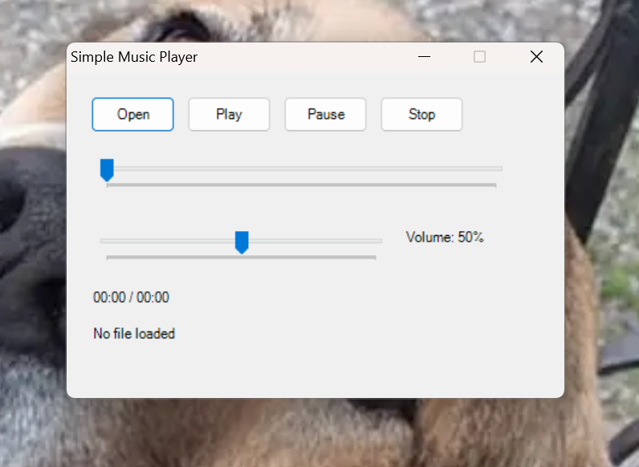

# Simple Music Player
A simple music player made in C# that can play mp3 files, wav files , aac files, mid files , midi files and wma files.

### How to Run
Go to the Releases section and download the latest version.
### How To Compile
To **Build From Source** you need to 
1. Download the source code
2. Have **.NET 4.8** Installed
3. Open Command Prompt
4. Type
   ```cmd
   csc /target:winexe "Music Player Source Code.cs"
   ```
5. Press *Enter*
6. Done!
### Antivirus Notice
Some antivirus engines may flag the compiled executable as suspicious.
This is a known issue with small, unsigned applications and heuristic detection systems.
**You can build it yourself to verify safety**
