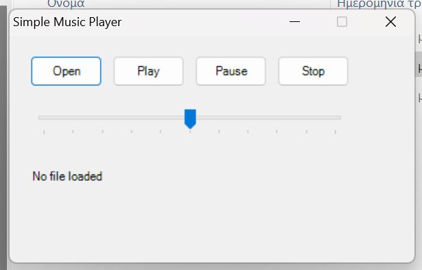

## Simple Music Player
A simple music player made in c# that can play mp3 files, wav files and wma files.

### How To Run
To run go to the releases tab and download the latest version.
### How To Compile
To **Build From Source** you need to 
1. Download the source code
2. Have **Dot Net** Installed
3. Open Command Prompt
4. type **C:\Windows\Microsoft.NET\Framework64\v4.0.30319\csc.exe /target:winexe "Music Player Source Code.cs"**
5. press *Enter*
6. Done!
### Antivirus Notice
Some antivirus engines may flag the compiled executable as suspicious.
This is a known issue with small, unsigned applications and heuristic detection systems.
